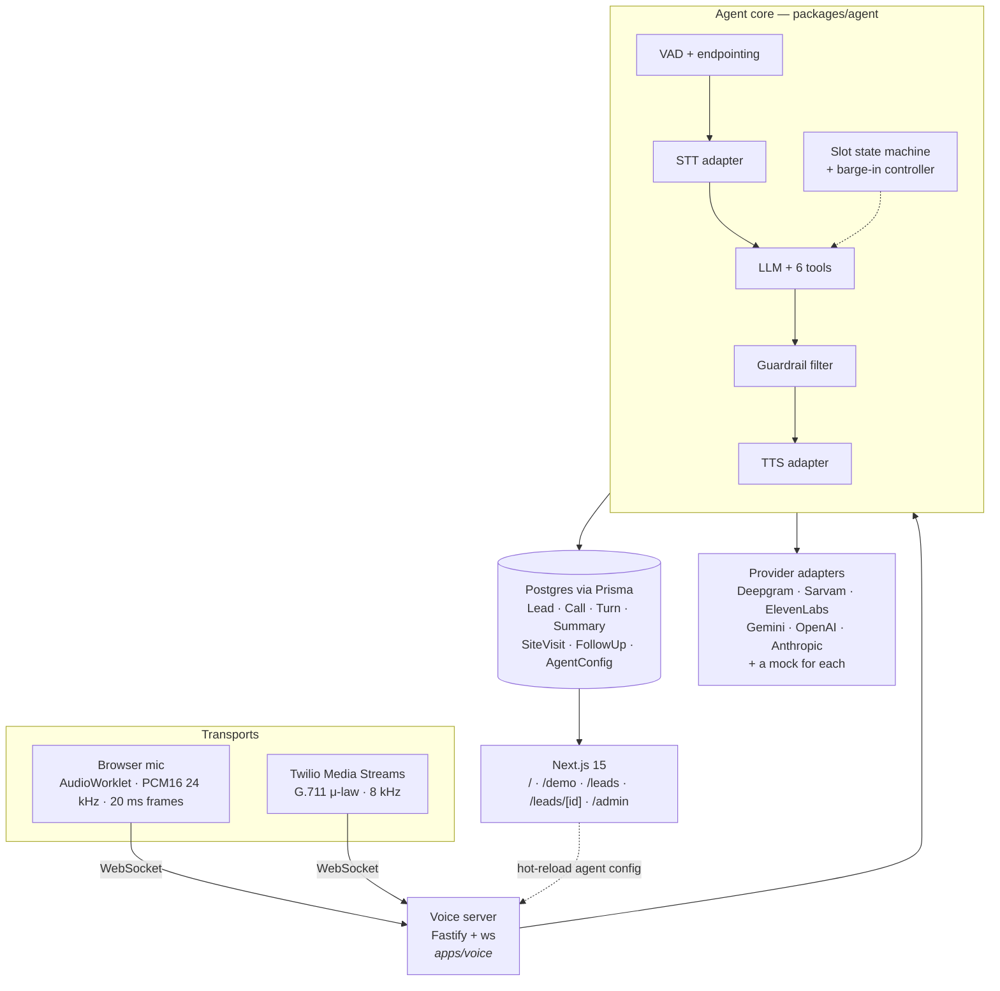
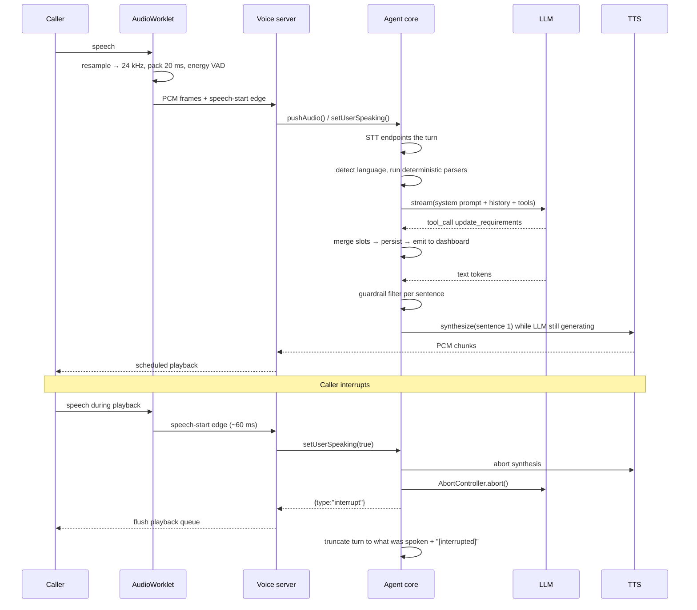

# Priya — AI voice sales agent for Indian real estate

A live, interruptible voice agent that calls a prospective buyer, speaks **Hindi, Hinglish and
English**, qualifies the lead against a deterministic slot machine, answers only what a
zod-validated knowledge base supports, and files a structured bilingual summary when the call ends.

> **Runs with zero API keys.** Every provider sits behind an interface with a mock. With an empty
> `.env` the browser transcribes locally, a rule-based LLM drives the whole flow, and the browser
> speaks the reply. Add keys to upgrade individual stages; each downgrades independently.

<!-- Replace with a screenshot of /demo mid-call, requirements panel filling in. -->


---

## 60-second quickstart

```bash
pnpm install
pnpm db:up          # Postgres 16 in Docker on port 5433
pnpm db:migrate     # apply the schema
pnpm db:seed        # 5 realistic completed calls so the dashboard is never empty
pnpm dev            # voice server :8787 + Next.js :3000
```

Open **http://localhost:3000/demo**, click the call button, and talk. No `.env` needed.

Want the full checks instead?

```bash
pnpm typecheck && pnpm lint && pnpm test && pnpm eval && pnpm build
```

---

## Architecture

The single most important decision: **the agent core is transport-agnostic.** It consumes an async
stream of PCM frames and emits PCM frames plus typed events. It has no idea whether it is talking to
a browser or a phone line. The browser handler and the Twilio handler are adapters that resample at
their own edge and translate events onto their own wire — barge-in, slot tracking, guardrails and
latency accounting are written exactly once.



One turn, end to end:



Full detail, including the latency budget and scaling notes: **[docs/ARCHITECTURE.md](docs/ARCHITECTURE.md)**.

---

## What it does

| | |
|---|---|
| **Mirrors the caller** | Per-turn language classifier (`hi` / `hi-en` / `en`) stored on every turn. Replies in the same register and switches mid-call. Hindi goes out in Devanagari with English loanwords left in Latin script. |
| **Interruptible** | Energy VAD in the worklet flags speech in ~60 ms. The server aborts TTS and the LLM stream, tells the client to flush, and truncates the assistant turn to what was actually heard. |
| **Cannot invent facts** | All property answers come from a zod-validated KB through tool calls. An output filter rewrites or blocks guarantees and forces "indicative" on prices, "expected" on timelines. |
| **Deterministic flow** | The LLM phrases; a slot state machine decides what still needs asking. Never re-asks a filled slot, honours refusals, accepts mid-call revisions, and gives up on a slot after two ignored attempts. |
| **Two transports** | Browser WebSocket and Twilio Media Streams over the same core. |
| **Every call is a record** | Leads, per-turn transcripts with latency breakdowns, tool traces, bilingual summaries, versioned agent config. |
| **Live reconfiguration** | `/admin` writes a new `AgentConfig` version and pushes a reload — the next call uses it, no redeploy. |

---

## Repository layout

```
apps/
  web/        Next.js 15 App Router — landing, demo console, dashboard, admin
  voice/      Fastify + ws — realtime pipeline, Twilio webhooks, /healthz
packages/
  shared/     zod WS protocol, audio utils (μ-law, resampling), language classifier
  db/         Prisma schema, migrations, seed, repositories
  agent/      KB, prompts, NLU, guardrails, tools, orchestrator, provider adapters
docs/         architecture, submission, limitations, demo script, interview notes
```

---

## Environment

Every variable is optional. See [`.env.example`](.env.example) for where to get each key.

| Variable | Purpose | Without it |
|---|---|---|
| `DATABASE_URL` | Postgres connection | Falls back to the docker-compose URL; if unreachable the demo runs without persisting |
| `STT_PROVIDER` | `deepgram` \| `sarvam` \| `browser` \| `mock` | Best available key, else browser Web Speech |
| `LLM_PROVIDER` | `gemini` \| `openai` \| `anthropic` \| `mock` | Best available key, else `MockLLM` |
| `TTS_PROVIDER` | `sarvam` \| `elevenlabs` \| `browser` \| `mock` | Best available key, else browser speech synthesis |
| `DEEPGRAM_API_KEY` | Streaming STT, `language=multi` for Hinglish | STT downgrades |
| `SARVAM_API_KEY` | Saarika STT **and** Bulbul TTS | Both downgrade |
| `ELEVENLABS_API_KEY` + `ELEVENLABS_VOICE_ID` | Flash v2.5 TTS | TTS downgrades |
| `GEMINI_API_KEY` | Default LLM | `MockLLM` |
| `TWILIO_ACCOUNT_SID` / `_AUTH_TOKEN` / `_PHONE_NUMBER` | Phone calls | Phone path returns a clear 503 |
| `PUBLIC_BASE_URL` | Builds the `wss://` stream URL for TwiML | Inferred from the request host |
| `ALLOWED_ORIGINS` | CORS allowlist for the browser socket | `http://localhost:3000` |
| `INTERNAL_API_TOKEN` | Guards `/internal/*` on the voice server | Endpoints are open (fine locally) |

---

## Scripts

| Command | What it does |
|---|---|
| `pnpm dev` | Voice server + Next.js + package watchers |
| `pnpm build` | Build every package and app |
| `pnpm typecheck` | `tsc --noEmit` across the workspace |
| `pnpm lint` | ESLint over the monorepo |
| `pnpm test` | Vitest units (108 tests) |
| `pnpm eval` | **16 scripted conversations through the real orchestrator, offline** |
| `pnpm e2e` | Playwright smoke test of the demo and dashboard |
| `pnpm db:up` / `db:down` | Start/stop Postgres in Docker |
| `pnpm db:migrate` / `db:seed` / `db:studio` | Schema, demo data, Prisma Studio |
| `pnpm setup` | install → db up → migrate → seed → build, in one go |
| `node apps/voice/scripts/smoke-call.mjs` | Drives a full call over the live WebSocket protocol |

---

## Testing

- **Unit** — μ-law codec against the G.711 error bound, streaming resampler drift, language
  classifier, budget parsing (`"50 lakh se 60 ke beech"`, `"1cr tak"`, `"pachaasi lakh"`, `"₹85,00,000"`),
  Indian phone parsing including spoken and Devanagari digits, `normalizeForTTS`, guardrails, slot
  merging and revision, KB inventory matching, summary schema.
- **Conversation eval** (`pnpm eval`) — 16 scripted calls through the *real* orchestrator with
  `MockLLM`: pure Hindi, pure Hinglish, pure English, mid-call requirement change, budget change,
  hostile caller, opt-out, wrong number, off-KB question, discount demand, loan question, declined
  slot, "who is this?", "are you a bot?", and silence. Asserts slots, outcome, tools called, and that
  no guardrail was violated. Prints a pass/fail table and exits non-zero on regression.
- **E2E** (`pnpm e2e`) — Playwright drives the real stack and checks the requirements panel fills,
  a mid-call revision overwrites, and the dashboard renders a bilingual summary.

---

## Deployment

| Piece | Target | Why |
|---|---|---|
| `apps/web` | Vercel | Static + server components; `vercel.json` included |
| `apps/voice` | Render or Fly.io | **Holds WebSockets for the length of a call — serverless cannot**; `render.yaml` included |
| Postgres | Neon | Serverless Postgres; set `DATABASE_URL` on both |

Step-by-step instructions are in [docs/SUBMISSION.md](docs/SUBMISSION.md#deployment).

---

## Documentation

- **[ARCHITECTURE.md](docs/ARCHITECTURE.md)** — turn sequence, latency budget, why cascading rather
  than speech-to-speech, barge-in mechanics, state management, scaling.
- **[SUBMISSION.md](docs/SUBMISSION.md)** — the submission form, how the conversation flow was
  built, challenges, next version.
- **[LIMITATIONS.md](docs/LIMITATIONS.md)** — blunt functional-vs-simulated table.
- **[DEMO_SCRIPT.md](docs/DEMO_SCRIPT.md)** — three full call scripts, the mid-call drill, a video
  shot list, and a pre-interview checklist.

---


