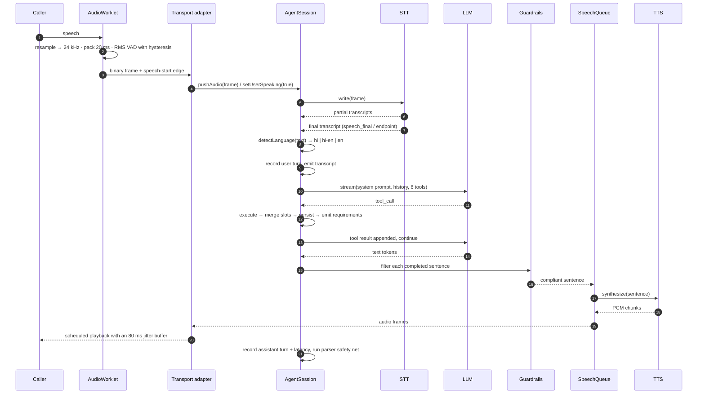

# Architecture

## The decision everything else follows from

**The agent core is transport-agnostic.** `AgentSession` in `packages/agent/src/orchestrator/session.ts`
consumes an async stream of PCM16 frames plus text, and emits PCM16 frames plus a typed `AgentEvent`
union. It never imports a socket, a Fastify type, or anything Twilio-shaped.

Everything transport-specific lives in an adapter:

| | `apps/voice/src/transports/browser.ts` | `apps/voice/src/transports/twilio.ts` |
|---|---|---|
| Inbound audio | PCM16 24 kHz, already correct | μ-law 8 kHz → decode → resample to 24 kHz |
| Outbound audio | PCM16 24 kHz binary frames | resample to 8 kHz → μ-law → base64 JSON |
| Barge-in | worklet VAD edge over the socket | energy VAD on the decoded stream, plus a `clear` message so Twilio drops its own buffer |
| Events | `ServerMessage` JSON | Twilio `media` / `mark` / `clear` |

The payoff is concrete: barge-in, the slot state machine, guardrails, language mirroring, latency
accounting and persistence are implemented **once** and both transports get them. Adding a third
(a SIP trunk, a WhatsApp voice note) means writing one translator, not re-implementing the agent.

The same property is what makes `pnpm eval` meaningful. The eval harness drives the *real*
orchestrator through `pushText()` with an in-memory store — no sockets, no database, no network — so
a failing eval means the conversation logic broke, not that a mock drifted.

---

## One turn, in order

Two details worth pointing at:

**Sentences are synthesised while the model is still generating.** `SpeechQueue` runs concurrently
with the LLM stream. `takeSpeakableChunks()` peels complete sentences off the token buffer (with a
140-character fallback for a model that forgets punctuation) and enqueues them immediately. Awaiting
the full generation before synthesising would add the entire generation time to time-to-first-audio.

**A deterministic parser runs after every turn.** `applySafetyNet()` re-parses the caller's utterance
and fills any slot the model failed to record — but *only* slots that are still empty, so an explicit
tool call always wins. A missed budget is the most expensive extraction failure in this domain, and
this makes it survivable.

---

## Latency budget

Target: **first audio byte under 1.2 s** after the caller stops speaking. Measured per turn and
written to `Turn.sttMs / llmFirstTokenMs / ttsFirstByteMs / totalMs`, then surfaced on `/demo` and on
every call detail page.

| Stage | Budget | Where it goes |
|---|---|---|
| Endpoint hold | 100–600 ms | Deliberate silence wait before we believe the turn ended. Deepgram `endpointing=100` for code-switching; the buffered Sarvam path uses the 600 ms energy endpoint. |
| STT finalisation | 50–250 ms | Streaming providers have already transcribed; this is the last partial being promoted. The Sarvam REST path pays one round trip here instead. |
| LLM first token | 200–500 ms | Gemini 2.5 Flash on a short system prompt. A tool round trip adds one more hop, which is why `update_requirements` is cheap and local. |
| TTS first byte | 150–400 ms | ElevenLabs Flash v2.5 with `optimize_streaming_latency=3`, or Sarvam Bulbul returning a short first sentence. |
| Client jitter buffer | 80 ms | Fixed lead time in `AudioPlaybackQueue` so a network hiccup does not produce a gap. |

`sttMs` is measured from **the last inbound frame containing speech**, so it deliberately *includes*
the endpoint hold. That is the number governing what the caller actually experiences; reporting only
the provider's processing time would flatter the system.

Levers, in the order I would pull them:

1. Shorten the endpoint hold — biggest single win, at the cost of cutting off slow speakers.
2. Cache the system prompt (Gemini/Anthropic prompt caching) — it is the largest constant input.
3. Speculative TTS on the first clause before the sentence completes.
4. Co-locate the voice server with the LLM region; `render.yaml` already pins Singapore.

---

## Why cascading STT → LLM → TTS, not speech-to-speech

Speech-to-speech models are lower latency and sound better. They were still the wrong choice here:

- **Grounding.** The hard requirement is that no property fact is ever invented. A cascading pipeline
  gives a text boundary where tool calls are forced and an output filter can rewrite or block a
  claim. A speech-to-speech model gives audio out — there is nowhere to insert a compliance check.
- **Auditability.** The rubric asks where lead data is stored and what the agent said. Text turns are
  greppable, diffable and exportable; the tool trace on each call detail page exists because every
  decision passed through text.
- **Language control.** Mirroring Hindi vs Hinglish requires inspecting each turn and choosing a
  script for the next one. That is a text-level decision.
- **Provider independence.** Six adapters behind three interfaces means the STT, LLM and TTS choices
  are independent. Speech-to-speech couples them to one vendor.
- **Cost.** Roughly ₹3–5 per 5-minute call cascading with Gemini Flash + Sarvam, versus several times
  that for realtime speech-to-speech.

If the requirement were purely "sound as natural as possible", the answer flips.

---

## Barge-in

The rubric calls this "handle simple customer interruptions"; it is the hardest part of the pipeline
to get right, because the failure mode is the agent talking over the caller.

1. **Detection happens on the client.** The AudioWorklet runs an energy VAD with hysteresis: three
   consecutive voiced 20 ms frames (~60 ms) to start, twelve silent frames to stop. The asymmetry is
   deliberate — a natural pause mid-sentence must not read as end-of-speech. Only *edges* are sent,
   not per-frame state.
2. **The client cuts its own audio immediately**, without waiting for the server. `AudioPlaybackQueue.flush()`
   stops every scheduled `AudioBufferSourceNode`, including buffers already queued in the future.
3. **The server aborts both streams.** `AgentSession.interrupt()` calls `SpeechQueue.abort()` (which
   aborts the in-flight TTS fetch via `AbortController`) and then aborts the LLM generation with the
   turn's `AbortController`. Order matters: stop producing audio first.
4. **The client is told to flush** with `{type:"interrupt"}`, covering the case where the server
   detected the interruption first (STT `SpeechStarted`).
5. **History is truncated honestly.** `SpeechQueue` reports each chunk *after* it has actually been
   emitted; the assistant turn is rewritten to that text plus `[interrupted]`. Without this the model
   believes it said things the caller never heard, and the next turn references them.

On the phone path there is a sixth step: send Twilio `{event:"clear"}`, because Twilio buffers
outbound audio on its own side and would otherwise keep playing for about a second.

Echo cancellation is not optional. `getUserMedia` is opened with `echoCancellation: true`; without
it the agent's own voice returns through the microphone and triggers a false barge-in on every turn.

---

## State management

Three layers, deliberately separated.

**`QualificationTracker`** (`packages/agent/src/conversation/state.ts`) — the deterministic half.
Owns the slots, the declined set, the ask counts and the question order. The LLM never decides what
to ask next; it asks `nextSlot()`. This kills the classic failure modes:

- re-asking a filled slot → `nextSlot()` skips filled slots
- looping on a refusal → `decline()` removes it permanently
- ignoring a revision → `merge()` overwrites filled slots and reports `isRevision: true`
- asking a slot forever → after two ignored attempts it is auto-declined and the call moves on

**`AgentSession`** — the turn state machine (`idle → listening → thinking → speaking → listening`),
the abort controllers, latency accounting, the language mix, and the compliance backstop that ends
the call on opt-out or hostility *even if the model did not call `end_call`*.

**`AgentRuntimeConfig`** — persona, greetings, extra guardrails, slot order and KB overrides, loaded
from a versioned `AgentConfig` row. Swapped atomically: a call in progress keeps the config it
started with, because changing persona mid-sentence produces a visibly inconsistent agent.

---

## Grounding and guardrails

Two independent mechanisms, because a prompt is a request and not an enforcement point.

1. **Tool-only facts.** The system prompt tells the model what *exists*; `get_project_info` and
   `check_matching_units` tell it what is *true*. The KB is zod-validated at module load, so a
   malformed project cannot even be imported. Admin overrides are re-parsed through the same schema —
   an invalid patch is rejected before it is persisted.
2. **Output filter.** `filterAgentOutput()` runs on every sentence before TTS. Nine rules: `rewrite`
   substitutes compliant text ("assured returns" → "returns depend on market conditions"), `block`
   drops the sentence entirely (predicting a price double, manufactured scarcity). It then *forces*
   the framing: any quoted figure gets "indicative and subject to availability", any possession date
   gets "expected as per the current construction plan".

Every rule is written with `wordPattern()`, a Unicode-aware boundary helper. JavaScript's `\b` is
ASCII-only, so `/\bपक्का\b/` never matches — a `\b`-delimited guardrail silently leaves Hindi, the
language the agent speaks most, completely unguarded. The eval caught this; the unit tests now pin it.

---

## Language handling

- **Detection** is rule-based (`packages/shared/src/language.ts`): Devanagari share, plus Hindi and
  English *function-word* sets. Function words rather than nouns, because "budget" and "location" are
  shared between Hinglish and Indian English. Homographs (`the`, `to`, `me`, `par`) are excluded from
  the Hindi set — keeping them made every English sentence containing "the" look code-mixed.
- **Short utterances inherit** the previous turn's language. "3BHK" carries no grammar; guessing from
  one token flips register at random.
- **Output script** is chosen per register: Devanagari for `hi`, Latin for `hi-en` and `en`, with
  English loanwords ("2 BHK", "budget", "possession", "site visit", "RERA") left in Latin either way.
- **`normalizeForTTS()`** rewrites text for the voice: `₹85,00,000` → "pachaasi lakh rupees",
  `1.2 Cr` → "ek point two crore", `2BHK` → "two B-H-K", `EMI` → "E-M-I", plus markdown and emoji
  stripping. Hindi cardinals 0–100 are a lookup table in both scripts, because there is no rule that
  gets you from 8 and 80 to "athaasi".

---

## Data model

`Lead` → `Call` → `Turn`, with `Summary`, `SiteVisit` and `FollowUp` hanging off a call, and
`AgentConfig` versioning behaviour.

Enum policy: values that are valid identifiers (call outcome, lead status, temperature) are Postgres
enums so the database enforces them. Slot vocabularies containing characters Postgres enums cannot
express (`hi-en`, `4BHK+`, `3_months`) are text, validated by the zod schemas in `@rvagent/shared`,
which stay the single source of truth across the WebSocket, the database and the React panel.

`Turn` carries the latency breakdown and a `toolCalls` JSON trace, which is what makes the call
detail page auditable rather than just a transcript.

---

## Scaling

**What breaks first: provider concurrency, not the Node process.** Each active call holds one STT
socket, one LLM stream and one TTS stream. A single voice server instance handles roughly 40–60
concurrent calls before the audio event loop matters; provider rate limits bite well before that.

The path to 1000 concurrent calls:

1. **Horizontal, sharded by call.** Sessions are already independent and hold no cross-call state.
   Put a WebSocket-aware load balancer in front and run N instances; nothing needs to be shared.
2. **Move persistence off the hot path.** Turn writes currently await Prisma. At scale they become
   fire-and-forget onto a queue; the in-memory buffer already exists for the summarizer, so a dropped
   write costs a dashboard row, not the call.
3. **Pool provider connections** and pre-warm STT sockets — connection setup is 100–200 ms that
   currently lands inside the first turn.
4. **Cache the system prompt.** At 1000 concurrent calls the constant prefix dominates token spend.
5. **Regional pinning.** Indian callers, Singapore/Mumbai compute, and an LLM region in the same
   continent. Cross-region hops are the single largest avoidable latency.
6. **Backpressure.** The browser adapter already refuses to queue audio past 512 KB buffered; the
   equivalent at fleet level is refusing new calls above a concurrency watermark rather than
   degrading every call in flight.

**Cost per call** (5 minutes, cascading, current pricing): STT ≈ ₹2, LLM ≈ ₹0.5–1 with Flash, TTS ≈
₹1.5–3 depending on provider. Roughly **₹4–6 per call**, dominated by speech rather than the model.

---

## Build and tooling notes

- **pnpm workspaces + Turborepo.** Packages compile with plain `tsc` to `dist/`; no bundler in the
  library path, so stack traces point at real files.
- **ESM with NodeNext resolution** and explicit `.js` extensions on relative imports — the boring
  setup that works identically under `tsx`, `node dist/`, Vitest and Next.
- **Prompts are markdown.** `prompts/sales-agent.md` is the versioned, reviewable source; a build
  step compiles it into a string constant so the running server never touches the filesystem. A unit
  test regenerates it in memory and fails if the two drift.
- **Turbopack for the Next build.** The legacy webpack pipeline crashes on this Windows environment:
  one of its plugins globs upward out of the repo and hits protected profile junctions
  (`C:\Users\<name>\Cookies`). Turbopack is the default for `next dev` in 15 and stable for builds in
  15.5, so this is where the project was heading regardless.
